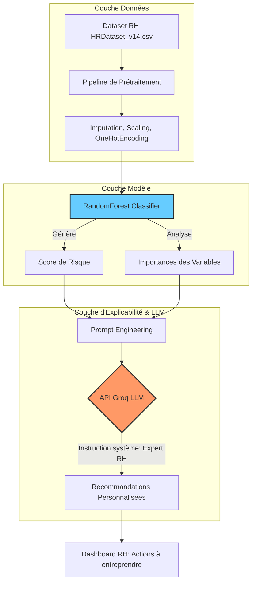

# Hackathon Explainability AI - Groupe 13

## 🚀 Installation et Exécution

### Prérequis
- Python 3.8 ou supérieur
- Clé API Groq (obtenir sur https://console.groq.com/)

### Étapes d'installation

1. **Cloner le dépôt**
   ```bash
   git clone https://github.com/Laidanan/Hackathon_Explainability_AI_Groupe13.git
   cd Hackathon_Explainability_AI_Groupe13
   ```

2. **Configurer l'environnement virtuel**
   ```bash
   python -m venv .venv
   # Sur Windows :
   .venv\Scripts\activate
   # Sur Linux/Mac :
   source .venv/bin/activate
   ```

3. **Installer les dépendances**
   ```bash
   pip install -r requirements.txt
   ```

4. **Configurer la clé API**
   - Créer un fichier `.env` dans le répertoire racine
   - Ajouter votre clé Groq :
     ```
     GROQ_API_KEY=votre_clé_api_ici
     ```

5. **Lancer l'application**
   ```bash
   uvicorn app:app --host 0.0.0.0 --port 8000 --reload
   ```

6. **Accéder à l'application**
   - Ouvrir un navigateur à l'adresse : http://localhost:8000

## 🧪 Tests

### Tests automatisés
```bash
# Test de l'API santé
curl http://localhost:8000/api/health

# Test du ranking (top 5)
curl "http://localhost:8000/api/ranking?top_n=5"

# Test manuel d'un employé
curl -X POST "http://localhost:8000/api/manual" \
  -H "Content-Type: application/json" \
  -d '{
    "name": "Test Employee",
    "department": "IT/IS",
    "position": "Software Engineer",
    "salary": 75000,
    "absences": 5,
    "emp_satisfaction": 4,
    "engagement_survey": 4.2,
    "days_late_last30": 1,
    "special_projects_count": 3
  }'
```

### Tests fonctionnels
1. **Interface Web** : Vérifier que la page d'accueil se charge
2. **Classement** : Vérifier l'affichage des employés/personas à risque
3. **Chat IA** : Tester les recommandations pour un profil sélectionné
4. **Ajout manuel** : Tester l'ajout d'un nouvel employé via le formulaire

## 📋 Objectifs du projet

L'objectif de cette solution est d'aider les départements des Ressources Humaines à anticiper le turnover au sein de l'entreprise. En combinant l'analyse prédictive (Machine Learning) et l'IA générative (LLM), le système permet de :

- Identifier proactivement les profils à risque de démission via un score de probabilité
- Comprendre les facteurs de risque spécifiques à chaque employé (ex: charge de travail, manque d'engagement, ancienneté)
- Proposer des pistes de rétention personnalisées grâce à un assistant IA expert

## 🎯 Périmètre (Scope)

- **Data Processing** : Nettoyage, normalisation et feature engineering des données RH brutes
- **Modélisation** : Classification supervisée (RandomForest) pour l'attribution d'un score de risque de départ
- **Interface LLM** : Utilisation de l'API Groq pour générer des recommandations RH basées sur les données traitées

**Limites** : Le système est un outil d'aide à la décision. Il ne remplace pas le dialogue humain et doit être utilisé dans le respect de la confidentialité des données et de l'éthique RH.

## 👤 Persona : Qui utilise cet outil ?

**Responsable RH / Manager** : Utilisateur principal qui consulte les listes d'employés à risque, examine les détails d'un profil spécifique et s'appuie sur les conseils générés par l'IA pour préparer ses entretiens de rétention.

## 🏗️ Architecture actuelle

- `app.py` : API FastAPI + orchestration UI/LLM/ranking
- `static/index.html` : interface web (classement + chatbot + formulaire RH)
- `predictive_model/model_service.py` : chargement modèle, scoring, explications/fallback
- `predictive_model/artifacts/` : modèle sauvegardé et metadata (`best_model.joblib`, `best_model_meta.json`)
- `predictive_model/persona_db.json` : base locale de personas (seed + ajouts RH persistés)
- `llm/llm_client.py` : appel LLM
- `llm/prompt_builder.py` : construction du prompt RH
- `llm/config.py` : configuration clé API
- `code.ipynb` : notebook data science/training
- `HRDataset_v14.csv` : dataset source

## ⚠️ Points d'attention (Éthique & Sécurité)

- **Biais** : Ce modèle a été entraîné sur des données historiques. Veillez à ne pas automatiser des décisions basées uniquement sur ces résultats sans examen humain
- **Sécurité** : Ne jamais inclure votre clé API dans le code source ou dans un commit Git

## 📊 Schéma d'architecture du système


